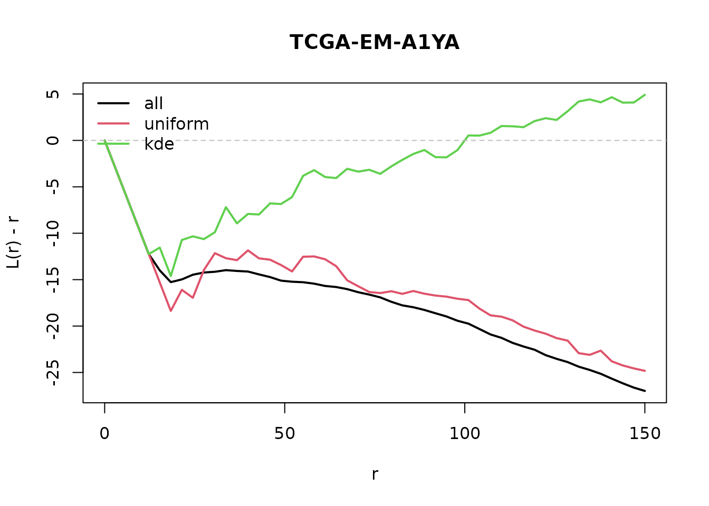

# Downsampling

``` r

library(SpaFun)
```

## Downsampling

Whole-slide patterns have up to millions of cells, too many for
`Lcross`. These functions reduce the number of points. All of them take
either `n_target` (number of points) or `prop` (fraction), and return a
`ppp` with the attribute `"downsample"` describing what was done.

``` r

library(SpaFun)
library(spatstat.geom)
data(tcga_crops)
pp <- tcga_crops[[1]]
pp
#> Marked planar point pattern: 20294 points
#> Multitype, with levels = 
#>    benign epithelial inflammatory necrotic neoplastic no label stromal
#> window: binary image mask
#> 462 x 462 pixel array (ny, nx)
#> enclosing rectangle: [51732.79, 66513.58] x [14780.797, 29561.593] units
```

### downsample

Wrapper: chooses the method with `method` and accepts a single `ppp` or
a list of samples. Lists are processed in parallel with `future.apply`
(choose the backend with
[`future::plan()`](https://future.futureverse.org/reference/plan.html));
results are reproducible after
[`set.seed()`](https://rdrr.io/r/base/Random.html).

With `marks` only the listed cell types are kept; with `by_marks = TRUE`
each type is downsampled separately, so `n_target` is the number of
cells *per type*.

``` r

library(spatstat.random)
#> spatstat.random 3.5-2
set.seed(1)
X <- rpoispp(2000)
Y <- downsample(X, method = "uniform", prop = 0.1)
attr(Y, "downsample")
#> $method
#> [1] "uniform"
#> 
#> $n_orig
#> [1] 1971
#> 
#> $n_kept
#> [1] 197

# several samples, in parallel
# future::plan(future::multisession, workers = 4)
Xs <- list(a = rpoispp(2000), b = rpoispp(3000))
Ys <- downsample(Xs, method = "window", n_target = 500)
sapply(Ys, spatstat.geom::npoints)
#>   a   b 
#> 505 504
```

### downsample_uniform

Uniform random thinning. Independent thinning leaves the K and L
functions (cross-type ones included) unchanged: this is the method to
use before `Lcross`.

``` r

library(spatstat.random)
set.seed(1)
X <- rpoispp(2000)
spatstat.geom::npoints(downsample_uniform(X, n_target = 300))
#> [1] 300
```

### downsample_KDE

Sampling with probability proportional to `1 / density`. It makes the
pattern more homogeneous, so it **changes** K and L: use it for
visualisation, not before estimating `Lcross`.

The density is computed on a pixel grid and looked up at the points, and
the weighted sampling uses the Efraimidis-Spirakis algorithm: half a
million points take about a second.

``` r

library(spatstat.random)
set.seed(1)
X <- rMatClust(20, 0.05, 100)
Y <- downsample_KDE(X, prop = 0.2)
spatstat.geom::npoints(Y)
#> [1] 453
```

### downsample_window

Keeps all the points inside randomly chosen square tiles until
`n_target` is reached. The window of the result is the union of the
tiles, so edge corrections stay correct; the largest usable `r` gets
smaller.

``` r

library(spatstat.random)
set.seed(1)
X <- rpoispp(2000)
Y <- downsample_window(X, prop = 0.25)
plot(Y)
```


### Internal helpers

### Effect on the L-cross function

On a real crop: the L-cross function between neoplastic and stromal
cells on all the cells, after uniform thinning and after KDE
downsampling (20% of the cells of each type). Negative values of L(r) -
r mean that the two types are segregated. Uniform thinning gives the
same curve up to noise; KDE downsampling pushes it towards 0, the value
for homogeneous independent patterns, and hides the segregation.

``` r

set.seed(1)
pp3 <- tcga_crops[["TCGA-EM-A1YA"]]
r <- seq(0, 150, length.out = 50)
lc <- function(x) {
  spatstat.explore::Lcross(x, "neoplastic", "stromal", r = r,
                           correction = "border")$border
}
pp_uni <- downsample(pp3, "uniform", prop = 0.2, by_marks = TRUE)
pp_kde <- downsample(pp3, "kde", prop = 0.2, by_marks = TRUE)

curves <- cbind(all = lc(pp3), uniform = lc(pp_uni), kde = lc(pp_kde))
matplot(r, curves - r, type = "l", lty = 1, lwd = 2, col = 1:3,
        xlab = "r", ylab = "L(r) - r", main = "TCGA-EM-A1YA")
abline(h = 0, lty = 2, col = "grey")
legend("topleft", colnames(curves), col = 1:3, lty = 1, lwd = 2, bty = "n")
```


