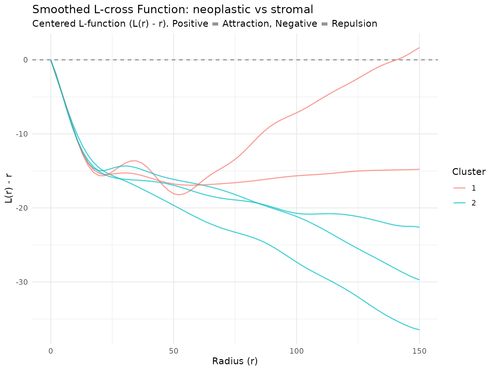
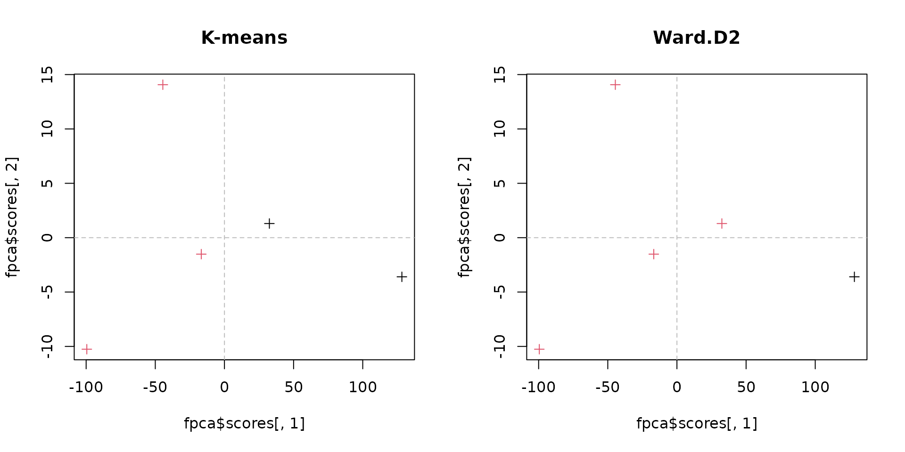

# FDA pipeline

``` r

library(SpaFun)
```

## Setup and Libraries

``` r

library(SpaFun)
library(data.table)
library(fda)
library(ggplot2)
library(dplyr)
library(tidyr)
```

## Data Loading

The input is a table with the column `r_value` and one column per slide
with its L-cross function (see the “Lcross pipeline” vignette). On the
HPC it is read from disk:

``` r

input_file <- "/projects/shared/TCGA_data/results/combined_Lcross.csv"

message("Reading data from: ", input_file)
dt <- fread(input_file)
message("Successfully loaded data with ", nrow(dt), " rows and ", ncol(dt), " columns.")
```

Here we build it from the 5 example crops in `tcga_crops`, so this
vignette runs anywhere. With only 5 curves the analysis below is a
demonstration: the full analysis uses all the TCGA slides.

``` r

data(tcga_crops)
r_values <- seq(0, 150, length.out = 70)

set.seed(10)
subs <- downsample(tcga_crops, method = "uniform", n_target = 5000,
                   marks = c("neoplastic", "stromal"), by_marks = TRUE)
L_list <- lapply(subs, function(x) {
  spatstat.explore::Lcross(x, i = "neoplastic", j = "stromal",
                           r = r_values, correction = "border")$border
})
dt <- data.table(r_value = r_values, as.data.table(L_list))
dim(dt)
#> [1] 70  6
```

## Functional Data Smoothing

We apply the `fsmooth` function to convert the raw data points into a
continuous functional data object.

``` r

message("Applying fsmooth function...")
#> Applying fsmooth function...
smoothed_Lfun <- fsmooth(dt, M = 6, genLfun.fd = 4, centered = FALSE)
```

## Functional Principal Component Analysis (fPCA)

We perform Functional PCA on the smoothed $`L`$-functions. The number of
harmonics cannot exceed the number of curves: we use 3 with the 5
example curves (10 on the full TCGA data).

``` r

# Run fPCA
n_harm <- min(10, ncol(dt) - 2)
fpca <- pca.fd(smoothed_Lfun$fd, nharm = n_harm, smoothed_Lfun$fdPar)

# Assign sample names (excluding the 'r_values' column) to the PCA scores
rownames(fpca$scores) <- colnames(dt)[-1]
```

## Unsupervised Clustering

We apply two clustering techniques to the scores of the first two
principal components. On the full data we look for 6 groups; with the 5
example curves we use 2.

### K-means & Hierarchical Clustering

``` r

# Set seed for reproducibility
set.seed(123)

# number of groups: 6 on the full data, fewer with the example curves
k <- min(6, nrow(fpca$scores) - 3)

# K-means clustering
fpca_km <- kmeans(fpca$scores[, 1:2], centers = k)

# Hierarchical clustering (Ward's method)
fpca_hc <- hclust(dist(fpca$scores[, 1:2]), method = "ward.D2")
memb_hc <- cutree(fpca_hc, k = k)
```

### Cluster Distribution Comparison

Below are the distribution tables comparing the cluster assignments
between both methods.

``` r

message("K-means cluster sizes:")
#> K-means cluster sizes:
table(fpca_km$cluster)
#> 
#> 1 2 
#> 2 3

message("Hierarchical clustering cluster sizes:")
#> Hierarchical clustering cluster sizes:
table(memb_hc)
#> memb_hc
#> 1 2 
#> 1 4
```

## Visualizations

### Smoothed L-functions Plot

We visualize the smoothed $`L`$-functions, color-coded by their K-means
cluster assignments.

Function to plot the smoothed Lcross functions

``` r

plot_smoothed_Lfun(
  smoothed_obj = smoothed_Lfun, 
  clusters_vec = fpca_km$cluster, 
  mark_i = "neoplastic",  
  mark_j = "stromal",
  center_plot = TRUE      # Subtracts 'r' since centered = FALSE in fsmooth
)
```



### PC Scores Comparison

Finally, we project and compare the sample distributions in the reduced
PCA space using both clustering results.

``` r

# Set up side-by-side plotting layout
par(mfrow = c(1, 2))

# K-means plot
plot(fpca$scores[, 1], fpca$scores[, 2], col = fpca_km$cluster, pch = 3, main = "K-means")
abline(v = 0, lty = "dashed", col = "grey")
abline(h = 0, lty = "dashed", col = "grey")

# Hierarchical clustering plot
plot(fpca$scores[, 1], fpca$scores[, 2], col = memb_hc, pch = 3, main = "Ward.D2")
abline(v = 0, lty = "dashed", col = "grey")
abline(h = 0, lty = "dashed", col = "grey")
```



``` r


# Reset layout
par(mfrow = c(1, 1))
```
