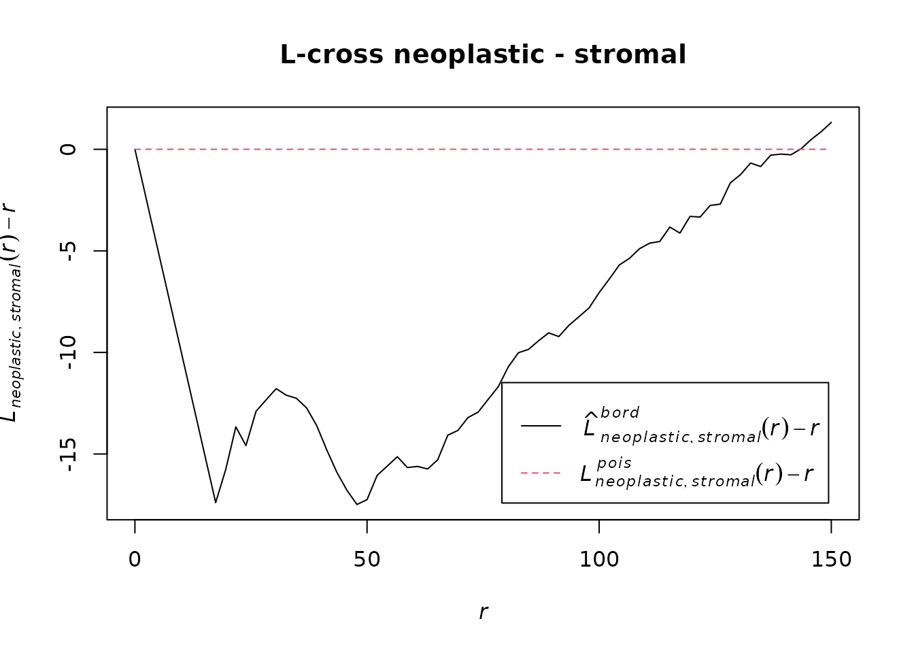

# Lcross pipeline

``` r

library(SpaFun)
```

This pipeline reads the cells of a slide and its tissue mask, builds a
point pattern, reduces the number of cells and estimates the L-cross
function between two cell types (here neoplastic and stromal cells).

The code runs on the example data shipped with the package. The chunks
that work on the full TCGA data on the HPC are shown but not run
(`eval: false`).

## Setup

``` r

library(SpaFun)
library(spatstat.geom)
library(spatstat.explore)
```

## Reading a slide

[`ann2ppp()`](https://revalescente.github.io/SpaFun/reference/ann2ppp.md)
reads the h5ad file and uses the PNG mask as window. The masks are
thumbnails at 1.25x and the coordinates are at 40x, so each mask pixel
is 40 / 1.25 = 32 coordinate units.

On the HPC, for one slide:

``` r

sample_dir <- "/projects/shared/TCGA_data/h5ad/TCGA-TS-A7P8-01Z-00-DX1.25E9AFA9-6C12-4F18-BE79-2F4F19887ECD.h5ad.gz"
save_dir   <- "/projects/shared/TCGA_data/results/test"

file_name <- sub("\\.h5ad\\.gz$", ".rds", basename(sample_dir))
save_path <- file.path(save_dir, file_name)

mask_path <- sub("/h5ad/", "/mask/", sample_dir)
mask_path <- sub("\\.h5ad\\.gz$", ".png", mask_path)

pp_object <- ann2ppp(sample_dir, mask = mask_path, magnif = 40,
                     thumb_mag = 1.25, marks_col = "type")
```

The same call on the small example file shipped with the package (it
holds only a small square of a slide, while the mask covers the whole
slide):

``` r

f    <- system.file("extdata", "tcga_tiny.h5ad", package = "SpaFun")
mask <- system.file("extdata", "tcga_tiny_mask.png", package = "SpaFun")

if (requireNamespace("anndataR", quietly = TRUE)) {
  pp_tiny <- ann2ppp(f, mask = mask, magnif = 40, marks_col = "type")
  print(pp_tiny)
  print(table(marks(pp_tiny)))
}
#> Marked planar point pattern: 1527 points
#> Multitype, with levels = 
#>    benign epithelial inflammatory necrotic neoplastic no label stromal
#> window: binary image mask
#> 2736 x 2896 pixel array (ny, nx)
#> enclosing rectangle: [0, 92672] x [0, 87552] units
#> 
#> benign epithelial      inflammatory          necrotic        neoplastic 
#>                33                29                 8              1313 
#>          no label           stromal 
#>                31               113
```

For the next steps we use a larger example: a crop of a slide with all
its cells, from `tcga_crops`.

``` r

data(tcga_crops)
pp_object <- tcga_crops[[1]]
table(marks(pp_object))
#> 
#> benign epithelial      inflammatory          necrotic        neoplastic 
#>               492               323                86             16931 
#>          no label           stromal 
#>               528              1934
```

## Downsampling

Whole slides have up to millions of cells. We keep only neoplastic and
stromal cells and reduce each type separately with uniform thinning,
which leaves the L-cross function unchanged (see the “Downsampling”
vignette).

On the HPC:

``` r

set.seed(10)
ppp_sub <- downsample(pp_object, method = "uniform", n_target = 40000,
                      marks = c("neoplastic", "stromal"), by_marks = TRUE)
```

On the example crop, with a smaller target:

``` r

set.seed(10)
ppp_sub <- downsample(pp_object, method = "uniform", n_target = 5000,
                      marks = c("neoplastic", "stromal"), by_marks = TRUE)
attr(ppp_sub, "downsample")$n_kept_by_mark
#> 
#> neoplastic    stromal 
#>       5000       1934
```

## L-cross function

``` r

r_values <- seq(0, 150, length.out = 70)

Lcross_neoStroma <- Lcross(
  ppp_sub,
  i = "neoplastic",
  j = "stromal",
  r = r_values,
  correction = "border"
)

plot(Lcross_neoStroma, . - r ~ r, main = "L-cross neoplastic - stromal")
```



On the HPC the result of each slide is saved to disk:

``` r

saveRDS(Lcross_neoStroma, file = save_path)
```

## Several slides

For the functional analysis we need one curve per slide, all on the same
`r` grid, in a table with the column `r_value` and one column per slide
(the input of the “FDA pipeline” vignette).
[`downsample()`](https://revalescente.github.io/SpaFun/reference/downsample.md)
accepts a list of patterns and processes them in parallel if a
[`future::plan()`](https://future.futureverse.org/reference/plan.html)
is set.

``` r

set.seed(10)
subs <- downsample(tcga_crops, method = "uniform", n_target = 5000,
                   marks = c("neoplastic", "stromal"), by_marks = TRUE)

L_list <- lapply(subs, function(x) {
  Lcross(x, i = "neoplastic", j = "stromal", r = r_values,
         correction = "border")$border
})

Lcross_table <- data.frame(r_value = r_values, L_list, check.names = FALSE)
head(Lcross_table[, 1:4])
#>     r_value TCGA-05-4382 TCGA-CF-A8HY TCGA-EM-A1YA
#> 1  0.000000            0    0.0000000            0
#> 2  2.173913            0    0.0000000            0
#> 3  4.347826            0    0.0000000            0
#> 4  6.521739            0    0.0000000            0
#> 5  8.695652            0    0.0000000            0
#> 6 10.869565            0    0.9650164            0
```

On the HPC, the saved `.rds` files are combined in the same way:

``` r

files <- list.files(save_dir, pattern = "\\.rds$", full.names = TRUE)
L_list <- lapply(files, function(f) readRDS(f)$border)
names(L_list) <- sub("\\.rds$", "", basename(files))
Lcross_table <- data.frame(r_value = r_values, L_list, check.names = FALSE)
data.table::fwrite(Lcross_table,
                   "/projects/shared/TCGA_data/results/combined_Lcross.csv")
```
